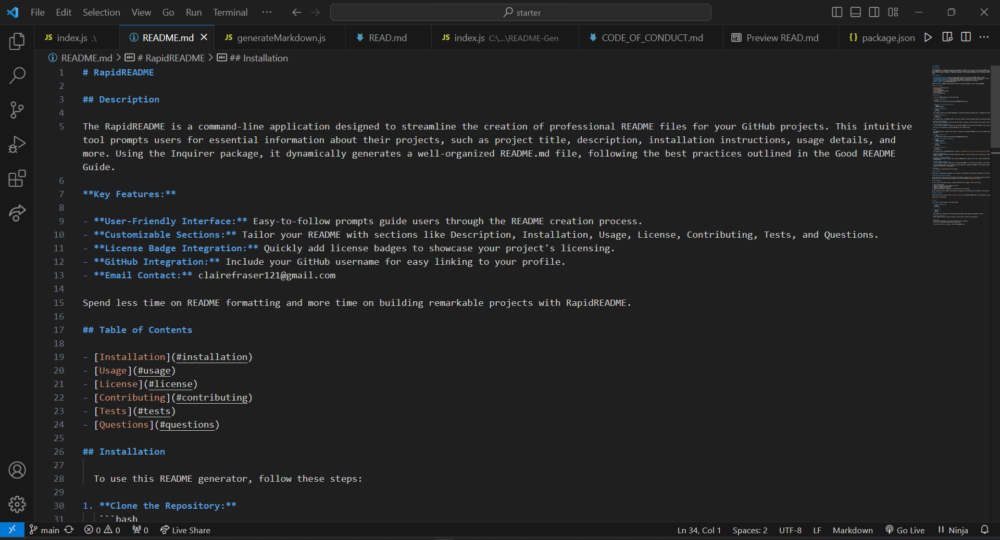
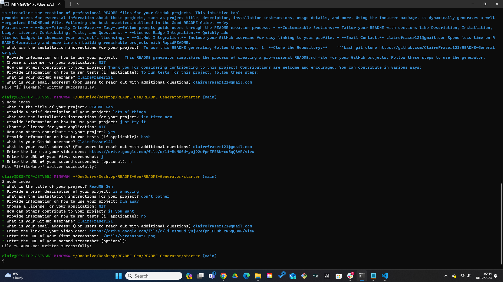

# RapidREADME

## Description

The RapidREADME is a command-line application designed to streamline the creation of professional README files for your GitHub projects. This intuitive tool prompts users for essential information about their projects, such as project title, description, installation instructions, usage details, and more. Using the Inquirer package, it dynamically generates a well-organized README.md file, following the best practices outlined in the Good README Guide.

**Key Features:**

- **User-Friendly Interface:** Easy-to-follow prompts guide users through the README creation process.
- **Customizable Sections:** Tailor your README with sections like Description, Installation, Usage, License, Contributing, Tests, and Questions.
- **License Badge Integration:** Quickly add license badges to showcase your project's licensing.
- **GitHub Integration:** Include your GitHub username for easy linking to your profile.
- **Email Contact:** clairefraser121@gmail.com

Spend less time on README formatting and more time on building remarkable projects with RapidREADME.

## Table of Contents

- [Installation](#installation)
- [Usage](#usage)
- [License](#license)
- [Contributing](#contributing)
- [Tests](#tests)
- [Questions](#questions)

## Installation

  To use this README generator, follow these steps:

1. **Clone the Repository:**
   ```bash
   git clone https://github.com/ClaireFraser121/README-Generator.git


2. **Navigate to the Project Directory:**
    ```bash
    cd README-Generator

3. **Install Dependencies:**
    ```bash
    npm install

  This command installs the required dependencies, including the Inquirer package used for prompting user input.

4. **Run the Application:**
    ```bash
    node index.js

  This command starts the README generator. Follow the prompts to input information about your project and generate a professional README.md file.

5. **Review and Customize:**
  Open the generated README.md file and review the content. Customize it further based on your project's specific details.

6. **Commit Changes (Optional):**
  If you've made any changes or additions to the generated README, you can commit those changes to your repository.

  Now you have a professionally formatted README for your GitHub project!

## Usage

  This README generator simplifies the process of creating a professional README.md file for your GitHub projects. Follow these steps to use the generator:

1. **Clone the Repository:**
    ```bash
    git clone https://github.com/ClaireFraser121/README-Generator.git

2. **Navigate to the Project Directory:**
    ```bash
    cd README-Generator

3. **Install Dependencies:**
    ```bash
    npm install

4. **Run the Application:**
    ```bash
    node index.js

  This command starts the README generator, and you'll be prompted with a series of questions about your project.

5. **Provide Information:**
  Answer the prompts to provide information about your project, such as the project title, description, installation instructions, usage details, license, and more.

6. **Review the Generated README:**
  The generator dynamically creates a well-organized README.md file based on your input. Review the generated README and make any additional customizations.

7. **Commit Changes (Optional):**
  If you've made any changes or additions to the generated README, you can commit those changes to your repository.

  By following these steps, you can quickly and easily generate a professional README for your GitHub projects, saving time and ensuring that your project's documentation is comprehensive.

## License
  This project is licensed under the MIT License.

  
[](https://opensource.org/licenses/MIT)

## Contributing

Thank you for considering contributing to this project! Contributions are welcome and encouraged. You can contribute in various ways:

### Bug Reports and Feature Requests

If you come across any issues or have ideas for new features, please [open an issue](https://github.com/ClaireFraser121/README-Generator/issues) on GitHub. Be sure to provide detailed information to help us understand and address the concern.

### Pull Requests

If you'd like to contribute directly, consider submitting a pull request. Follow these steps:

1. Fork the repository.
2. Create a new branch for your feature or bug fix.
3. Make your changes and commit them.
4. Push your changes to your fork.
5. Submit a pull request, providing a clear description of your changes.

Before submitting a pull request, ensure that your changes pass any existing tests and adhere to the project's coding standards.

### Code of Conduct

Please note that this project follows a [Code of Conduct](./CODE_OF_CONDUCT.md). By participating, you agree to uphold this code.

Thank you for contributing!


## Tests

To run tests for this project, follow these steps:

1. **Install Dependencies:**
   ```bash
   npm install
  

2. **Run Tests:**
   ```bash
    npm test

  This command will execute the tests and provide information about whether they passed or failed.

3. **Review Test Results:**
  After running the tests, review the output to ensure that all tests pass successfully.


  ## Questions
  If you have any questions, feel free to reach out to me on GitHub:
  [ClaireFraser121](https://github.com/ClaireFraser121)
  
  You can also contact me via email: clairefraser121@gmail.com

## Video Demo
  [Link to Video Demo](https://drive.google.com/file/d/1Vth9LJDEARqJWffb_jYAZJHnYbZHRqPN/view) 

  ## Screenshots
  
  

